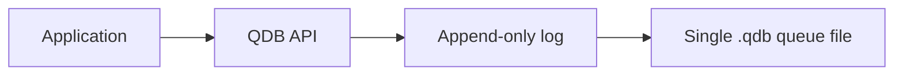

# QDB Architecture

QDB is an embedded queue library. An application calls the QDB API directly;
there is no separate server or broker process.

Every queue operation is stored as a durable append-only record in one `.qdb`
file. Records describe message pushes, leases, acknowledgements, negative
acknowledgements, and lease expiry. CRC validation detects damaged records
during reads and recovery.

QDB keeps the active queue state in memory. On startup, it replays the durable
log to rebuild that state before accepting new operations.

When a message is popped, QDB grants a lease instead of immediately deleting
the message. The application calls `qdb_ack()` after successful processing or
`qdb_nack()` to return it to the queue. Unresolved leases can expire and be
retried. This provides at-least-once delivery.
